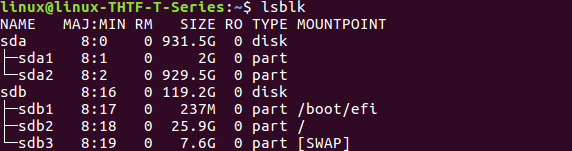
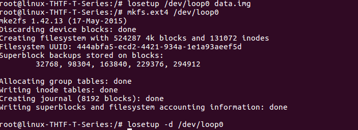
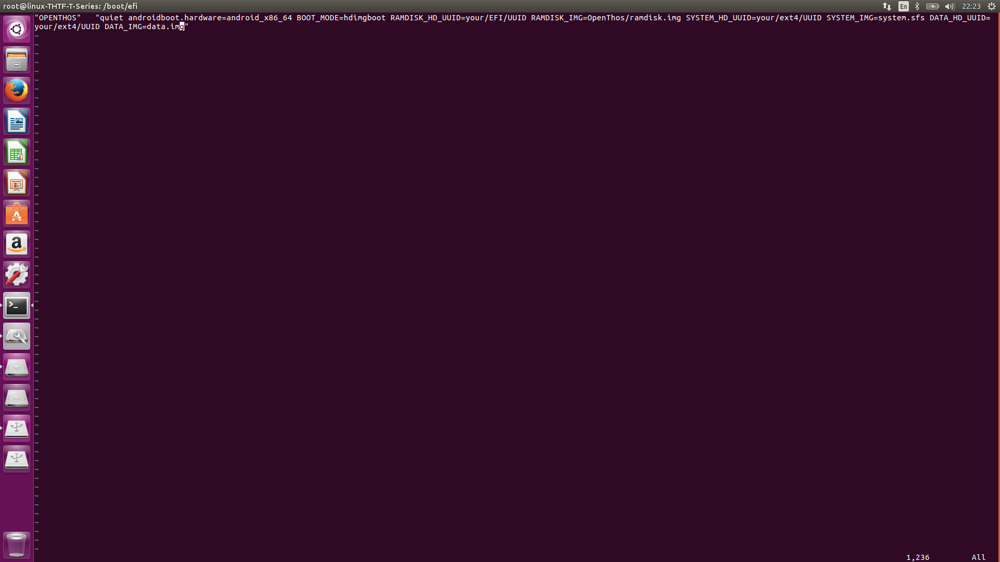
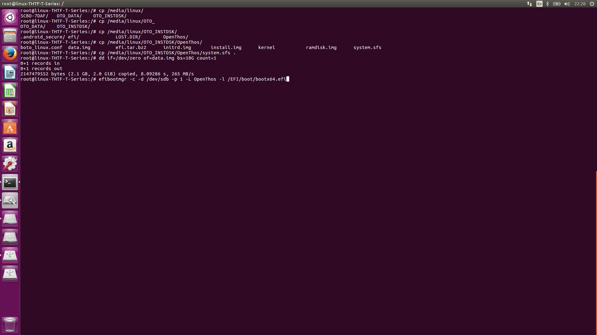

Dear Suleyman:  
I create a ubuntu system which has the similar partition scructure:  
  
Then I get a Openthos image:android_x86_64_oto.img and dd into USB storage.  
plug USB storage and you will get it mounted in /media/linux/OTO_INSTDSK  
- 1.copy /media/linux/OTO_INSTDSK/efi/boot /boot/efi/EFI/   
- 2.mkdir /boot/efi/OpenThos and copy /media/linux/OTO_INSTDSK/OpenThos/(boto_linux.conf,initrd.img,install.img,kernel,ramdisk.img) to /boot/efi/OpenThos
- 3.copy /media/linux/OTO_INSTDSK/OpenThos/system.sfs to /
- 4.make a data.img and format it:
```
dd if=/dev/zero of=/data.img bs=10G count=1  
losetup /dev/loop0 data.img
mkfs.ext4 /dev/loop0
losetup -d /dev/loop0
```
  
- 5.modify /boot/efi/OpenThos/boto_linux.conf like following:  
  
- 6.add boot option with efibootmgr  
  
Good luck!
thanks.
