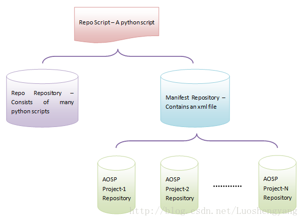

# 系统维护功能需求与设计实现文档
内容：

- 项目简介
- 功能需求
- 设计实现
- 存在问题

## 项目简介
openthos系统的开发环境构建与维护，包括基于docker的编译环境和基于git/repo的源代码版本管理。

## 功能需求
1.提供基于docker开发环境

2.提供基于git的版本管理环境

3.定期维护，备份开发环境

## 设计实现

设计包括开发编译环境构建，git/repo源代码版本管理系统构建，实时维护定期升级。

### 编译环境的构建
基于Docker实现开发环境的快速构建，一个可以短时间内启动所有开发环境所需服务的灵活便利的可行性方案。

在使用docker之前你要明白两个概念：
- image 镜像
- container 容器

这两个是整个docker的基础概念。image是静态的，类比为面向对象就是一个类；container是动态运行的，类比为面向对象就是一个实例化的对象。

一般，container是可运行的，我们启动一个container之后，这个container里面就是我们基于ubuntu的编译环境。

理解了基本概念，接下来要做的事情就是构建一个合适的的image，这个image里面应该包含一切开发编译时候所需要的东西。

之后基于此image创建container。启动container后我们就可以在这个container环境上工作了。这个时候container应该可以跟宿主共享文件，并且可以在本局域网内可以被访问到。

首先安装docker engine。

安装好之后创建新docker container:

`docker run -it -v $HOSTDIR:$DOCKERDIR --name ${name} ${IMGID} /bin/bash`

目前服务器的编译环境包括openthos-5.1和openthos-8.1两种，前者需要openjdk-7-jdk，后者需要openjdk-8-jdk。

启动docker命令:

`docker start -ai  ${name}-VER #例如 docker start -ai chenwei-5.1`

将会把外部目录/home/lh/xxx/${name} 映射至docker目录/root/${name}，所以大容量源码的下载编译需要在/root/${name}目录中操作。

### git/repo源代码版本管理系统
#### openthos源代码仓库结构

整个openthos源代码仓库包括三种类型的Git仓库：repo仓库，manifest仓库，aosp子项目仓库。

一个独立的repo脚本即常用的“repo”命令，获取repo仓库和manifest仓库。repo仓库通过manifest仓库获得所有aosp子项目仓库的元信息。repo仓库的Python脚本通过子项目的元信息来操作aosp的子项目。



*openthos源代码仓库整体结构*

#### openthos源代码代码同步

下载 repo 工具:
```
mkdir ~/binPATH=~/bin:$PATH
curl https://storage.googleapis.com/git-repo-downloads/repo > ~/bin/repo #repo也可下载：http://192.168.0.185/git-repo-downloads/repo
chmod a+x ~/bin/repo
```
建立工作目录:
`mkdir WORKING_DIRECTORY && cd WORKING_DIRECTORY`

初始化仓库, 并选择multiwindow Android-x86 版本:
```
repo init -u git://192.168.0.185/lollipop-x86/manifest.git -b multiwindow  
## 如果提示无法连接到 gerrit.googlesource.com，可以编辑 ~/bin/repo，把 REPO_URL 一行替换成下面的：
REPO_URL = 'git://192.168.0.185/git-repo' 或清华大学的源：REPO_URL = 'https://gerrit-google.tuna.tsinghua.edu.cn/git-repo'
```
同步源码树（以后只需执行这条命令来同步）:
`repo sync`

建立multiwindow开发分支:
`repo start multiwindow --all`

设置代码提交的远程仓库别名为“devorg”:
`repo forall -c 'git remote add devorg git://192.168.0.185/lollipop-x86/$REPO_PROJECT.git $@'`

上述步骤在首次操作完成后，便可开始代码开发：

在对某个project的代码进行更改前，请确保当前是multiwindow分支；

单个project提交，在该project目录下：
```
git commit -a -m "xxx commit"
git push devorg multiwindow:refs/heads/multiwindow 
```
## 存在问题

| 简述 | 类别 | 备注 |
|---|---|---|
|有时git下载操作缓慢|源代码|关闭不可访问的ipv6|
|编译环境时常出现空间不足|开发|可尝试对每位用户进行空间限额|
|repo版本管理还无法基于用户进行权限控制|源代码|无|

### 解决方法
- 发现git pull or git clone 很慢

把ipv6关闭，例如：
```
ifconfig eth0 del 33ffe:3240:800:1005::2/64

cat /proc/sys/net/ipv6/conf/all/disable_ipv6
显示0说明ipv6开启，1说明关闭

root@box.com:~# sysctl net.ipv6.conf.all.disable_ipv6
net.ipv6.conf.all.disable_ipv6 = 1
root@box.com:~# sysctl net.ipv6.conf.default.disable_ipv6
net.ipv6.conf.default.disable_ipv6 = 1
root@box.com:~# sysctl net.ipv6.conf.lo.disable_ipv6
net.ipv6.conf.lo.disable_ipv6 = 1
```
- 编译环境时常出现空间不足的情况

需要服务器管理时常提醒开发人员清理不必要的空间占用。
