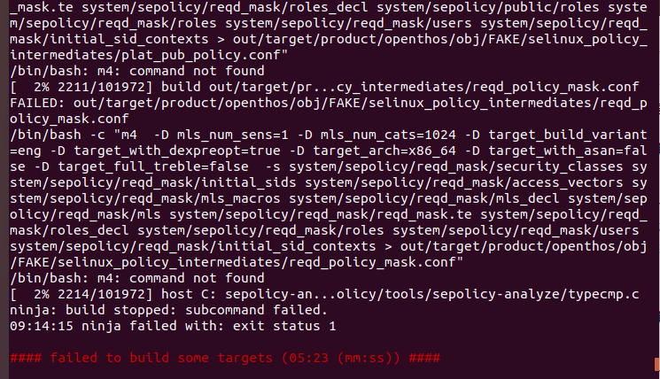
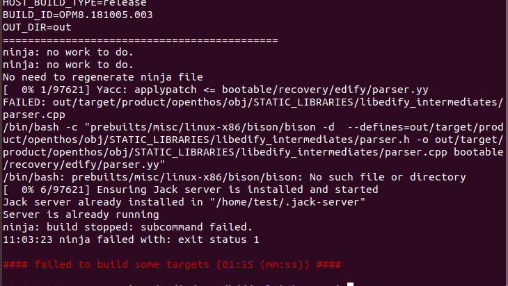
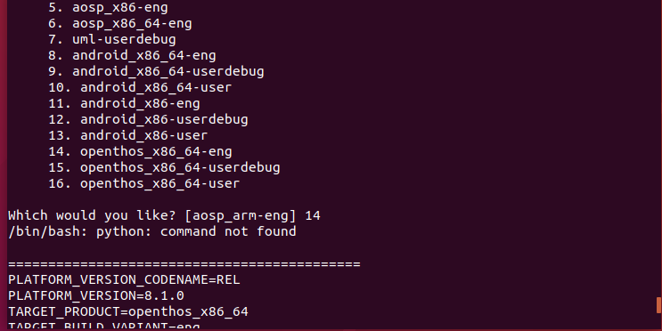
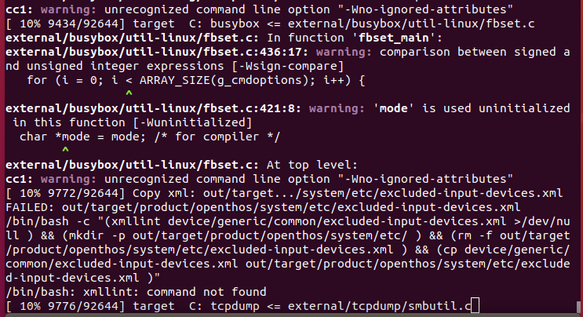
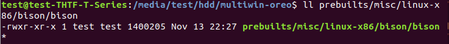
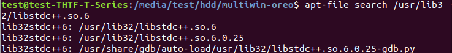
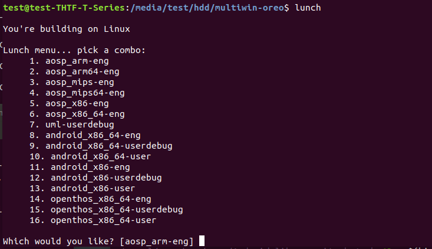
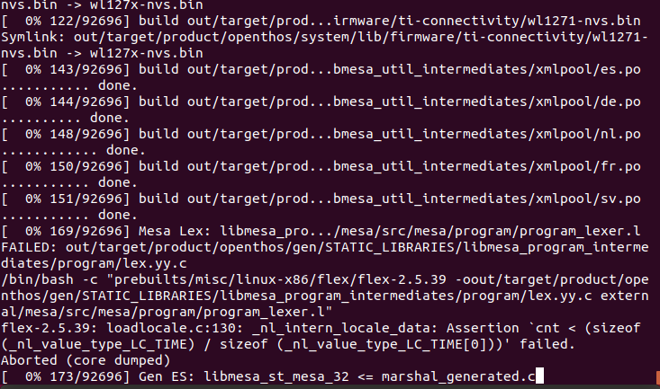

# OPENTHOS 8.1系统开发环境设置（基于Ｕbuntu18.04 LTS)

本文旨在提供一个在Ubuntu18.04下设置OPENTHOS8.1系统级编译环境的说明，以供有关工程师参考。

## 开发环境要求
要编译OPENTHOS8.1系统，需要满足一定的软硬件要求。下面将分别予以说明。

### 硬件要求

您的开发工作站必须达到或超出以下硬件要求：
* 64位双核以上X86_64 CPU，单核CPU也可以凑合编译，但编译时间极慢，建议5代i5以上。  
* 系统支持现代UEFI
* 硬盘空间  
   单纯下载代码用于查看需要至少50GB的可用磁盘空间；  
   如果是进行单次编译，需要至少175GB的可用磁盘空间；  
   如果是进行多次编译，需要200GB的可用磁盘空间。  
   如果您使用 ccache，则需要更多空间。  
* RAM, 2GB以上。建议16GB以上，对于内存不足16GB的，需要设置足够大的SWAP空间，这就意味着对于系统而言需要更大的硬盘空间。  
在我本人的实际环境搭建测试过程中发现，240GB的SSD在安装Ubuntu系统并开启足够的SWAP空间后，剩余空间约192GB,考虑到ext4文件系统需要保留5%以上的空间。实际可用空间不足180GB，仅能勉强完成一次编译，且编译后期非常缓慢。因此如何使用SSD，建议使用480GB以上产品。  
### 软件要求
Ubuntu 16.04或Ubuntu18.04，本例中我们仅以Ubuntu18.04为例进行介绍。  
其他版本的Ubuntu系统或是其它Linux发行版可能能满足开发的要求，但这些都不在本文的论述范围之内。  

## 系统安装及环境设置

###　Ubuntu18.04操作系统安装  
建议以UEFI的模式安装Ubuntu18.04。  
刻录Ubuntu18.04系统安装光盘或是生成安装U盘的方法以及Ubuntu18.04的安装过程，不在本文的介绍范围内，请自行通过搜索引擎查找相关信息。　　
建议安装过程中选择手动安装，并为系统配置一个16GB的SWAP分区。当然如果对Linux分区的概念不熟悉，也可以选择自动的方式进行安装，待安装完成后再创建一个SWAP文件。  
###*创建并启用swap文件(可选操作）*  
***注意***  
*如果您的系统的内存比较小，且未分配足够的内存，则在编译的过程中可能遇到如下的报错*  
  
这种情况通常出现在内存较小的机器上，OPENTHOS在编译过程中需要使用大量的内存空间来加快编译的速度，当内存耗尽时就会出现上图的报错。这时我们需要创建一个SWAP文件并通过此文件来充当交换分区来弥补内存不足的问题。方法如下：  
１. 创建一个SWAP文件
```bash
sudo dd if=/dev/zero of=/.16GB.swap
sudo chmod 600 /.16GB.swap
```  
2. 格式化SWAP文件
```bash
sudo mkswap /.16GB.swap
```  
３. 激活SWAP文件
```bash
sudo swapon /.16GB.swap
```  
４. 永久性启用SWAP文件  
按前３步激活的SWAP空间，在每次系统重启后都需要激活才能使用。如果希望永久性启用该SWAP文件，则需要将其添加的fstab中，让系统在启动时自动激活该SWAP空间。方法如下：
```bash
sudo echo '/.16GB.swap 　none  swap  sw  0 0' > /etc/fstab
```

### 环境设置
要在Ubuntu18.04正确编译，你需要安装如下软件包：
curl repo git m4 make lib32stdc++(或是g++-multilib) python python-mako openjdk-8-jdk zlig1g-dev libelf-dev libssl-dev 
其中受限于网络管控，repo无法直接通过apt安装，其余的软件包均可通过apt在线安装。方法是：  
```bash
sudo apt update
sudo apt install curl  git m4 make g++-multilib \
        python python-mako openjdk-8-jdk zlib1g-dev \
        libelf-dev libssl-dev libxml2-utils
```
#### 安装repo  
可以先进行如下的尝试:  
```bash
mkdir ~/bin
PATH=~/bin:$PATH
curl https://storage.googleapis.com/git-repo-downloads/repo > ~/bin/repo
chmod a+x ~/bin/repo
```  
不过通常与直接从apt安装repo一样，我们在受管控的网络环境中也很难从googleapis.com下载repo。因此我们可以从中科大的服务器借用一个他们mirror回来的repo。将上面的指令改成下面这样即可  
```bash
mkdir ~/bin
PATH=~/bin:$PATH
curl -sSL  'https://gerrit-googlesource.proxy.ustclug.org/git-repo/+/master/repo?format=TEXT' |base64 -d > ~/bin/repo
chmod a+x ~/bin/repo
```  
repo的运行过程中会尝试访问官方的git源更新自己，如果遇到提示无法连接到 gerrit.googlesource.com。则可改用中科大的镜像源进行更新，在你的~/.bashrc文件的最后加上一行如下的内容即可。
```
export REPO_URL='https://gerrit-googlesource.proxy.ustclug.org/git-repo'
```
***永久性设置PATH环境***  
前面的说明中设置的PATH环境，只是一次性有效。在某些非以自动方式安装Ubuntu系统的主机上，当“终端”程序被关闭重启后，您可能需要再一次设置PATH才能继续使用repo。  
检查您的~/.profile文件的最后部分是否有如下几行的内容：  
```
# set PATH so it includes user's private bin if it exists
if [ -d "$HOME/bin" ] ; then
    PATH="$HOME/bin:$PATH"
fi
```  
如果没有，则在~/.profile文件的最后加上这几行内容即可为当前用户永久性设置上相应的PATH环境变量。  
#### 关于各软件包的说明  
**curl及git**  
curl与git对于每一个开发人员来说意味着什么，这里我们不再缀述。  
**M4**  
在16.04以前，该软件包在build-essential包安装时，将一并安装。而在Ubuntu18.04环境中，m4不再包含于build-essential软件包中，如果不单独安装该软件包，在编译OPENTHOS的过程中将会出现错误提示`/bin/bash: m4: command not found`：  
  
**make**  
在16.04以前，该软件包在build-essential包安装时，将一并安装。而在Ubuntu18.04环境中，make不再包含于build-essential软件包中，如果不单独安装该软件包，在编译OPENTHOS的过程中将会出现错误提示`Command 'make' not found`：  
  
**lib32stdc++或g++-multilib**  
OPENTHOS8.1基于AOSP8.1，AOSP8.1中自带了一个prebuilt的bison，该bison程序在运行过程中需要用到stdc++的32位库，而这些库在AOSP的prebuilt中并未提供，因此需要单独安装。否则将会出现错误提示`/bin/bash: prebuilts/misc/linux-x86/bison/bison: No such file or directory`：  
  
**python**  
编译OPENTHOS8.1需要用到python2.7，而Ubuntu18.04中默认安装的是python3.x，因此需要手动安装python2.7。python2.7在Ubuntu18.04中的包名是python，如未安装，在编译OPENTHOS，将出现错误提示“/bin/bash: python: command not found”：  
  
**python-mako**  
编译OPENTHOS8.1需要用到python2.7的扩展模块mako，该模块的名称是python-mako，在Ubuntu18.04中需要手动安装.如未安装，在编译OPENTHOS，将出现错误提示“ImportError: No module name mako.template”：  
  
**openjdk-8-jdk**  
OPENTHOS8.1作为Android8.1的一个变体，其开发过程中必然同AOSP8.1一样要用到java，在Ubuntu18.04上我们要用到的软件包是openjdk-8-jdk。至于不安装java环境的后果，在此我们不作描述。  
**zlib1g-dev**  
OPENTHOS8.1在编译过程上中需要用到zlib1g-dev软件包中的libz，Ubuntu18.04系统默认只安装了zlib1g，因此需要手动安装zlib1g-dev.  
**libelf-dev及libssl-dev**  
AOSP本身未用到libelf-dev及libssl-dev软件包，但在编译OPENTHOS8.1的内核Modules时，系统需要用到libelf-dev软件包。因此需要手动安装该软件包。如果缺少这两个软件包，系统将会出现错误提示“kernel/Makefile:957: "Cannot user CONFIG_STACK_VALIDATION=y, please install libelf-dev, ..."”以及“kernel/scripts/extrack-cert.c:21:10: fatal error: openssl/bio.h: No such file or direcotry”:  
  

**libxml2-utils**  
OPENTHOS8.1中的部分组件需要用到xmllint来解析xml文件，在Ubuntu18.04上xmllint从属于软件包libxml2-utils，在Ubuntu18.04上该软件包默认并未安装libxml2-utils软件包，因此需要手动安装。如未安装，在编译OPENTHOS，将出现错误提示“/bin/bash: xmllint: command not found”：  
  
#### 关于如何确认编译时提示缺少的的程序或库是属于哪一个软件包  
当系统提示“/bin/bash: xxx: command not found”或是哪个库找不到时，说明编译OPENTHOS8.1要用到的该系统程序或库在Ubuntu18.04中尚未安装。如果我们知道该程序或库从属于哪个软件包可以直接调用“sudo apt install”进行安装。但往往程序或库的名字与其所属的软件包名称并不相同。这将导致我们不知道该安装哪个软件包来解决相关依赖。  
下面我们介绍一下在不知道包名的情况下，如何确定程序或库从属于哪个软件包。  
我们需要用到一个工具叫apt-file，下面我们安装apt-file并更新其数据库。  
```bash
sudo apt install apt-file
sudo apt-file update
apt-file search '<待查找文件>'
```
以xmllint为例，xmllint并不是一个完整的软件包名称，在OPENTHOS编译系统出现如下图错误提示“/bin/bash: xmllint: command not found”时：
  
只要在终端中运行  

```bash
apt-file search 'xmllint'
```
系统将列出所有与xmllint有关的软件包  
  
从其输出中我们可以看出可执行程序xmllint从属于软件包libxml2-utils，因此只要调用如下的命令安装libxml2-utils软件包即可。
```bash
sudo apt install libxml2-utils
```  
遇到缺少其他软件包的问题可以参考xmllint的情况解决。  
#### 明明程序在，却说找不到程序的情况
从AOSP8.0或是更最早的版本（具体哪一版本，我们未做验证），Google将很多编译系统所需要的程序都塞到了prebuilts中，比如前面提到的bison、flex，在编译AOSP时不再需要主机操作系统所提供的程序。这种大而全的设计：一方面貌似解决很多所需要程序的问题，从我们前面要安装的软件包列表就可以看出，确实较之以往，要安装的软件包少了很多；但实际上也带来了一些新的困扰，当我们在编译AOSP8+及其𧗠生产品时，我们会发现一些prebuilts中已经包含的程序在使用编译过程，编译系统却报找不到该程序。
比如前面提到的bison，在编译过程中就会被爆出找不到:  
  
初开始怀疑bison确实不存在或是权限有问题，然后通过ll命令查看bison文件发现文件存在且权限正常，如下图所示：  
  
因此便合理怀疑是不是bison的依赖关系未得到满足，导致其不能在Ubuntu18.04上执行。我们通过ldd命令来看看bison都调用了哪些库：   
  
经查Ubuntu18.04的默认安装内容中不包含“/usr/lib32/libstdc++6.so.6“，那么我们按前面方法所述用“apt-file search”查出“/usr/lib32/libstdc++6.so.6“源自于哪个软件包：  
  
从上图我们可以看出库“/usr/lib32/libstdc++6.so.6“来自于软件lib32stdc++6，调用“apt install”安装lib32stdc++6软件包后，发现其他库也都有了。重新编译发现，不再报找不到bison的错误。  
如果今后发现其他prebuilts中存在的程序被报找不到的错误，可以参考这个思路解决。
## 下载OPENTHOS8.1代码  
**建立工作目录:**  
```bash
$ mkdir WORKING_DIRECTORY
$ cd WORKING_DIRECTORY
```
**初始化仓库, 并选择multiwindow-oreo版本:**
```bash
repo init -u git://192.168.0.185/nougat-x86/manifest.git -b multiwindow-nougat
repo sync
```
## 编译OPENTHOS8.1  
在终端中执行如下命令  
```bash
cd WORKING_DIRECTORY
source build/envsetup.sh
lunch
```
系统给出如下选单:  
  
选择14到16的以openthos开头的项目即可  
现在可以运行编译命令开始整个编译的过程。  
```bash
make oto_img  #此为生成用于机器的.img文件
```
### 编译过程中可能出现的错误  
绝大部分可能出现的问题，我们在上一章“环境设置”中都有所提及，且给出了我们是如何分析出安装什么样的软件包来解决问题的。  
不过在编译时仍有可能出现一个问题，此不问题不是安装软件包可以解决的。  
#### flex工作异常
OPENTHOS8.1继承自AOSP8.1的prebuilts/mis/linux-x86/flex/flex-2.5.39与Ubuntu18.04存在一定的兼容性问题，在UTF8的locale下，将在编译过程中出现错误提示“flex-2.5.39: loadlocale.c:130: \_nl_intern_locale_data: Assertion ...... failed.”:  
  
解决的方法共有两种：  
1. 编译时指定环境变量LC_ALL=C或LC_TYPE=C
```bash
LC_ALL=C make oto_img  #此为生成用于机器的.img文件
```
2. 解压prebuilts/misc/linux-x86/flex/flex-2.5.39.tar.gz，在Ubuntu18.04下重新编译，将生成的flex复制成prebuilts/misc/linux-x86/flex/flex-2.5.39  
#### java编译器堆空间不足异常
由于AOSP在编译过程中要消耗大量的内存，在某些内存不是太大的机器上可能会出现这个问题。比如我们用于测试的机器，8GB内存，经由编译系统其他部分的占用后，可用内存在java编译器工作时，自动分配的堆空间仍不够用。  
  
解决的方法是通过设置环境变量告诉jack-server建立一个较大的java堆空间。  
```bash
jack-admin kill-server
export JACK_SERVER_VM_ARGUMENTS="-Dfile.encoding=UTF-8 -XX:+TieredCompilation -Xmx4g"
jack-admin start-server
```  
***注：jack-admin在source build/envsetup.sh后可用  
## 试运行及安装OPENTHOS8.1  
### 生成安装U盘
```bash
$ sudo dd if=out/target/product/openthos/openthos_x86_64_oto.img of=/dev/sdx #需要根据主机上的硬盘确定，对于只有一块硬盘的主机而言通常U盘是/dev/sdb
```
### 运行  
1. 将刚生成的U盘插入到目标计算机上，并按下目标计算机的电源以启动目标计算机
2. 设置目标电脑为UEFI模式启动，在启动时按F10/F12（根据具体的机器而言，通常是F10或是F12，但也有可能是其他按键）进入到启动引导项选择界面。选择从U盘启动，并回车。
3. 在新出现的图形选单上，按左右键选择OPENTHOS，回车便可以以liveusb方式启动OPENTHOS，如需要其他方式，请在按回车前按F2键。  
现在您可以尽情感受OPENTHOS带来的极致体验了。  

